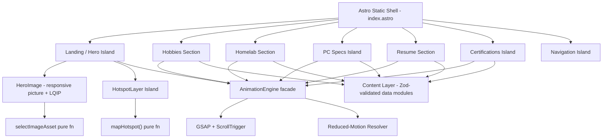
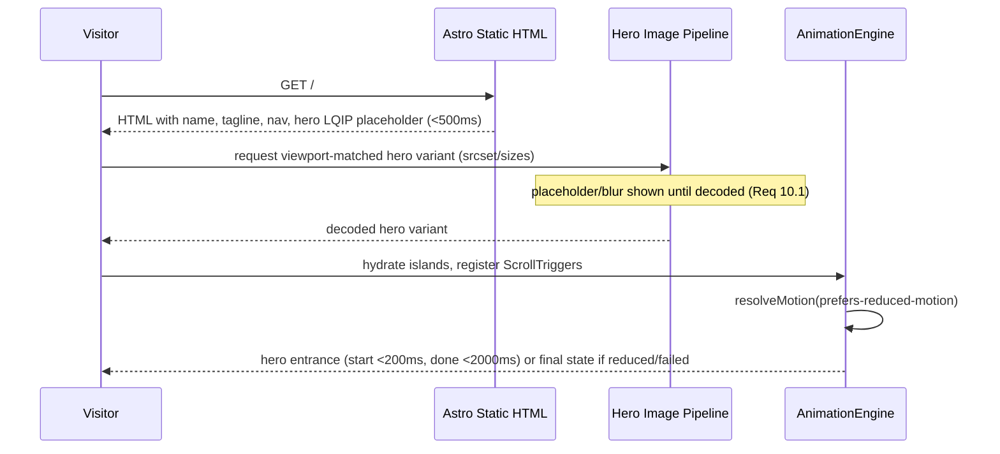

# Design Document

## Overview

The Portfolio_Site is a static-first, animation-rich single-page experience for Ganesh Biradar. It is built around a large portrait Hero_Image (3000x3878) of his workspace with interactive hotspots, followed by scroll-revealed content sections (Hobbies, Homelab, PC Specs, Resume, Certifications).

The core engineering tensions this design resolves are:

1. **Rich, fluid 60fps animation** vs. **fast first paint** with a very large hero asset. We solve this with a static-first framework, an islands hydration model, responsive image variants + LQIP placeholders, and a GPU-friendly animation strategy (transform/opacity only).
2. **Immersive motion** vs. **accessibility**. We centralize all motion behind a single `AnimationEngine` abstraction that resolves every animation against the Visitor's `prefers-reduced-motion` setting and against a graceful-fallback contract, so no section can ever be left invisible if an animation or asset fails.
3. **Interactive hotspots over a cover-cropped image** vs. **responsive scaling**. Hotspots are authored as resolution-independent normalized coordinates and projected into the rendered image box by a pure mapping function, so they stay glued to the PC and soldering station across every viewport from 360px to 2560px.

### Technology Choices

| Concern | Choice | Rationale |
|---|---|---|
| Framework | **Astro 4** with **React islands** + **TypeScript** | Astro ships zero JS by default and renders content as static HTML, directly serving the 3s above-the-fold requirement (10.5). Interactive pieces (hotspots, PC specs, nav toggle) hydrate as isolated React islands, keeping the JS payload minimal. |
| Styling | **Tailwind CSS** + CSS custom properties | Utility-first responsive design with built-in breakpoints (360–2560px range), `motion-reduce:` variants, and `clamp()`-based fluid typography. |
| Animation engine | **GSAP 3** + **ScrollTrigger** | Timeline-based control, high-performance transform/opacity animation, robust scroll-driven reveals, and precise start/complete timing needed to meet the millisecond bounds in Requirements 1, 3, 4, 8. Wrapped behind our own `AnimationEngine` facade. |
| Content validation | **Zod** | Runtime + build-time schema validation of all content models, enforcing count and length constraints from Requirements 3–7. |
| Responsive images | Astro `<Picture>` / native `<picture>` with `srcset`/`sizes` + AVIF/WebP/JPEG + base64 LQIP | Serves viewport-matched asset tiers (Req 10.2) and progressive placeholder rendering (Req 10.1). |
| Testing | **Vitest** + **fast-check** (property tests) + **@testing-library/react** (component/interaction) + **Playwright** (cross-device/e2e) | fast-check covers the pure logic layer; Playwright covers responsive/interaction behaviors and 60fps checks. |

### Why not a heavier SPA framework

A traditional client-rendered SPA (e.g., Next.js CSR or plain React) would ship and execute significantly more JavaScript before first paint, working against the strict above-the-fold and hero-placeholder timing requirements. Astro's static HTML output means the name, tagline, nav, and hero placeholder are present in the initial HTML response and paint without waiting on hydration; only genuinely interactive regions cost JS.

## Architecture

### High-Level Structure



### Layered Responsibilities

- **Presentation layer (Astro components + React islands)**: renders sections, wires DOM to the animation and content layers. Interactive islands: `HotspotLayer`, `PcSpecsShowcase`, `Navigation`, `CertificationCard`.
- **Animation layer (`AnimationEngine`)**: the single entry point for all motion. Every reveal, transition, hover highlight, and hotspot animation is requested through this facade. It owns reduced-motion resolution, timing bounds, and animation-failure fallbacks. No component calls GSAP directly.
- **Content layer**: typed, Zod-validated data modules (`content/*.ts`) that hold all textual and structural content (hobbies, homelab, PC components, resume, certifications, hotspot definitions). Components are pure renderers of this data.
- **Pure logic utilities**: side-effect-free functions that are the primary target for property-based testing — `selectImageAsset`, `mapHotspotToViewport`, `resolveMotion`, `computeCoverTransform`, and the Zod content parsers.

### Animation Engine Design

The `AnimationEngine` is a thin, testable facade over GSAP. Its contract:

- `reveal(target, options)` — scroll-triggered entrance; guarantees the target ends in its final visible state, plays at most once per page load, and begins/completes within the caller-specified bounds.
- `highlight(target)` / `removeHighlight(target)` — hover/focus highlight for hotspots, PC components, certification images.
- `transition(outgoing, incoming, options)` — section-to-section scroll transitions.
- `heroEntrance(target)` — the landing hero entrance animation.

Two cross-cutting rules are enforced centrally rather than per-component:

1. **Reduced-motion resolution**: Before starting any animation, the engine calls `resolveMotion(requestedMotion, prefersReducedMotion)`. When reduced motion is set, motion-based animations (translate/scale/rotate/parallax) are replaced by either an immediate (0ms) apply-final-state or a fade-only transition ≤200ms (Req 8.2). The engine reads the live `matchMedia('(prefers-reduced-motion: reduce)')` value.
2. **Fallback-to-final-state**: Every animation is wrapped so that if it fails to start, fails to complete, or its backing asset fails to load, the target is snapped to its fully visible final state with all text and interactivity intact and no visible error (Req 3.6, 4.x, 8.4, 8.5). Reveal targets render their final CSS state by default and the entrance animation sets the *initial* offset only after confirming the engine is live, so a JS failure leaves content visible rather than hidden.

### Rendering & Loading Flow



## Components and Interfaces

### Component Tree

- `Layout.astro` — document shell, fonts, global CSS, meta.
- `index.astro` — composes all sections in order.
  - `Navigation` (island) — responsive nav; toggle below 768px, inline links at ≥768px; one target per section.
  - `HeroSection.astro`
    - `HeroImage.astro` — responsive `<picture>` + LQIP + fallback background.
    - `HotspotLayer` (island) — renders hotspots, handles pointer/touch/keyboard activation, projects coordinates.
    - `HeroIntro.astro` — name + tagline.
  - `HobbiesSection.astro` — three distinct hobby entries with per-entry style+animation.
  - `HomelabSection.astro` — TrueNAS, mini-PC cluster, master/worker nodes, services list.
  - `PcSpecsShowcase` (island) — 11 interactive components.
  - `ResumeSection.astro` — casual narrative layout + formal resume download.
  - `CertificationsSection.astro` → `CertificationCard` (island ×3).
- `lib/animation/AnimationEngine.ts` — animation facade.
- `lib/logic/*.ts` — pure utilities.
- `content/*.ts` — Zod-validated content.

### Key Interfaces (TypeScript)

```typescript
// Pure logic layer -----------------------------------------------------------

type ImageTier = 'small' | 'medium' | 'large';

/** Req 10.2: <=480 -> small, 481-1024 -> medium, >1024 -> large */
function selectImageAsset(viewportWidth: number): ImageTier;

interface Box { width: number; height: number; }
interface Point { x: number; y: number; } // pixels within the rendered image box
interface NormalizedPoint { x: number; y: number; } // 0..1 relative to intrinsic image

/** object-position focal point, normalized 0..1 (Req 1.3: center-x, top 25%) */
interface FocalPoint { x: number; y: number; }

interface CoverTransform {
  scale: number;        // uniform scale applied to intrinsic image
  offsetX: number;      // px offset of image origin within the box
  offsetY: number;
  renderedWidth: number;
  renderedHeight: number;
}

/** Computes cover-fit transform preserving aspect ratio (Req 1.2, 1.3). */
function computeCoverTransform(
  intrinsic: Box,
  box: Box,
  focal: FocalPoint
): CoverTransform;

/** Projects a normalized hero coordinate into a pixel point within the box (Req 2.1). */
function mapHotspotToViewport(
  norm: NormalizedPoint,
  intrinsic: Box,
  box: Box,
  focal: FocalPoint
): Point;

// Motion resolution ----------------------------------------------------------

type MotionKind = 'translate' | 'scale' | 'rotate' | 'parallax' | 'fade';

interface MotionSpec {
  kind: MotionKind;
  startDelayMs: number;
  durationMs: number;
}

interface ResolvedMotion {
  mode: 'full' | 'fade' | 'immediate';
  durationMs: number;   // 0 for immediate; <=200 for fade
  startDelayMs: number;
}

/** Req 8.2 / 1.5 / 3.5 / 4.7: collapse motion when reduced-motion is set. */
function resolveMotion(spec: MotionSpec, prefersReducedMotion: boolean): ResolvedMotion;

// Animation engine facade -----------------------------------------------------

interface RevealOptions { startDelayMs: number; durationMs: number; motion: MotionSpec; }

interface AnimationEngine {
  heroEntrance(target: HTMLElement): void;                 // Req 1.4/1.5
  reveal(target: HTMLElement, opts: RevealOptions): void;  // Req 3.3/4.5/4.6
  highlight(target: HTMLElement): void;                    // Req 2.2/5.2/7.3
  removeHighlight(target: HTMLElement): void;              // Req 2.3/5.5/7.4
  transition(outgoing: HTMLElement, incoming: HTMLElement, opts: RevealOptions): void; // Req 8.3
}
```

### Interaction Contracts

- **Hotspots** (`HotspotLayer`): each hotspot is a `<button>` with ≥44×44px target, `aria-label`, focusable, and activatable by click, tap, and `Enter`/`Space`. Pointer/keyboard-focus triggers `highlight`; leaving/blur triggers `removeHighlight`. Activation reveals related content inline (PC hotspot surfaces a control that scrolls to PC_Specs; soldering hotspot reveals PCB-designing content). On reveal failure, the hero and other hotspots stay interactive and an "unavailable" indication is shown (Req 2.9).
- **PC specs** (`PcSpecsShowcase`): each of the 11 components is a keyboard-focusable, pointer- and touch-activatable control. Active state changes ≥1 visible attribute and shows detail (category + value); deactivation restores state and hides detail. Grid reflows to avoid horizontal scroll at ≥360px (Req 5.6, 9.1).
- **Navigation**: activating a target scrolls the corresponding section into view within 1000ms (Req 1.9); below 768px a single toggle expands/collapses the link list (Req 9.3).

## Data Models

All content is defined in typed modules and validated by Zod schemas at build time (and in tests). Count and length constraints from the requirements are encoded directly in the schemas so invalid content fails fast.

```typescript
import { z } from 'zod';

// Hero + hotspots
const HeroContent = z.object({
  name: z.literal('Ganesh Biradar'),
  tagline: z.string().min(1).max(160),                       // Req 1.7
  intrinsicWidth: z.literal(3000),
  intrinsicHeight: z.literal(3878),                          // Req 1.2
  focal: z.object({ x: z.literal(0.5), y: z.literal(0.125) }), // center-x, top 25% (Req 1.3)
  assets: z.object({
    lqip: z.string(),                                        // base64 blur placeholder
    small: z.string(), medium: z.string(), large: z.string(), // Req 10.2
  }),
});

const HotspotSubject = z.enum(['pc', 'soldering']);
const Hotspot = z.object({
  id: z.string(),
  subject: HotspotSubject,
  label: z.string().min(1),
  // normalized 0..1 center + size, resolution independent (Req 2.1)
  x: z.number().min(0).max(1),
  y: z.number().min(0).max(1),
  minTargetPx: z.literal(44),
});
const Hotspots = z.array(Hotspot)
  .refine(h => h.some(x => x.subject === 'pc') && h.some(x => x.subject === 'soldering'), 
    'must include a PC and a soldering hotspot')             // Req 2.1
  .refine(h => h.length >= 2, 'at least two hotspots');

// Hobbies (exactly 3)
const HobbyId = z.enum(['homelabbing', 'pcb-designing', '3d-modelling']);
const Hobby = z.object({
  id: HobbyId,
  label: z.string().min(1),
  styleVariant: z.string(),      // distinct visual style token
  animationVariant: z.string(),  // distinct animation token
});
const Hobbies = z.array(Hobby).length(3)                     // Req 3.1
  .refine(hs => new Set(hs.map(h => `${h.styleVariant}|${h.animationVariant}`)).size === hs.length,
    'each entry needs a unique style+animation combination'); // Req 3.2

// Homelab
const HomelabComponent = z.object({
  id: z.string(),
  title: z.string().min(1),
  description: z.string().min(1).max(500),
});
const SelfHostedService = z.object({
  name: z.enum(['Jellyfin', 'Immich', 'Seafile', 'qBittorrent', 'WireGuard']),
  purpose: z.string().min(1).max(280),                       // Req 4.4
});
const Services = z.array(SelfHostedService).length(5)
  .refine(s => new Set(s.map(x => x.name)).size === 5,
    'exactly the five named services');                      // Req 4.4

// PC specs (exactly 11, fixed category->value)
const PcComponent = z.object({
  category: z.enum(['CPU','GPU','RAM','Storage','Motherboard','Cooling',
                    'PSU','Case','Monitor','Mouse','Headphones']),
  value: z.string().min(1),                                  // Req 5.1/5.3
});
const PcComponents = z.array(PcComponent).length(11)         // Req 5.1/5.6
  .refine(c => new Set(c.map(x => x.category)).size === 11, 'unique categories');

// Resume
const Employment = z.object({
  employer: z.enum(['AmberStudent', 'IAMOPS', 'Mactores']),
  role: z.string().min(1),
  start: z.string().min(1),
  end: z.string().min(1),          // date or "Present" (Req 6.2)
});
const Project = z.object({
  name: z.enum(['AI-Driven Pipeline Failure Notifier', 'ECS to EKS Production Migration']),
  description: z.string().min(20).max(300),                  // Req 6.4
});
const ResumeContent = z.object({
  headline: z.string().min(1),                               // AWS DevOps/Cloud, 3+ yrs (Req 6.1)
  yearsExperience: z.number().min(3),
  employers: z.array(Employment).length(3),                  // Req 6.2
  achievements: z.array(z.string().min(1)).min(4),           // Req 6.3
  projects: z.array(Project).length(2),                      // Req 6.4
  formalResumeUrl: z.string(),                               // Req 6.6
});

// Certifications (exactly 3, one image each)
const Certification = z.object({
  name: z.enum([
    'AWS Certified Solutions Architect – Professional',
    'AWS Certified Solutions Architect – Associate',
    'AWS Certified Advanced Networking – Specialty',
  ]),
  imageUrl: z.string(),
  altText: z.string().min(1),                                // Req 7.5 fallback label
});
const Certifications = z.array(Certification).length(3)      // Req 7.1/7.2
  .refine(c => new Set(c.map(x => x.name)).size === 3, 'three distinct certifications');

// Navigation
const SectionId = z.enum(['hobbies','homelab','pc-specs','resume','certifications']);
const NavTarget = z.object({ sectionId: SectionId, label: z.string().min(1) });
const NavTargets = z.array(NavTarget).length(5)              // Req 1.8
  .refine(n => new Set(n.map(t => t.sectionId)).size === 5, 'one target per section');
```

### Content values (seeded from `main.md`)

- PC components map exactly to Req 5.1 (Ryzen 7 5800X3D, RX 7800XT, 32GB DDR4 3600, 1TB NVMe Gen4, Gigabyte X570S AERO G, Deepcool LT 360mm AIO, Corsair HX1000i, Lian Li O11 Dynamic, Alienware 25" 320Hz, Logitech G Pro X Superlight, HyperX Alpha Wireless).
- Resume content sourced from `main.md`: employers AmberStudent / IAMOPS / Mactores, achievements (25+ microservices ECS→EKS, $24K+/yr savings, up to 80% deploy-time reduction via Packer AMIs, multi-cloud AWS/AWS China/Alibaba), projects (AI-Driven Pipeline Failure Notifier, ECS to EKS Production Migration).
- Certifications: the three AWS certs listed in `main.md`.

## Correctness Properties

*A property is a characteristic or behavior that should hold true across all valid executions of a system — essentially, a formal statement about what the system should do. Properties serve as the bridge between human-readable specifications and machine-verifiable correctness guarantees.*

The properties below target the pure logic layer of the Portfolio_Site (image tier selection, cover-fit transform, hotspot projection, motion resolution, fluid typography, animation fallback contract, and content-schema validation). UI rendering, timing, and cross-browser performance criteria are covered by example, edge-case, and integration tests in the Testing Strategy section rather than as universally quantified properties.

### Property 1: Cover-fit preserves aspect ratio

*For any* intrinsic image size and any display box, `computeCoverTransform` produces a single uniform scale such that the rendered width-to-height ratio equals the intrinsic 3000:3878 ratio (no stretching or skewing).

**Validates: Requirements 1.2**

### Property 2: Cover-fit fully covers the box with the focal point visible

*For any* display box, the transform returned by `computeCoverTransform` yields rendered dimensions greater than or equal to the box in both axes with non-positive offsets (the image fully covers the box with no gaps), and the focal point (center-x, top 25%) projects to a coordinate inside the visible box.

**Validates: Requirements 1.3**

### Property 3: Hotspots project inside the rendered image box

*For any* hotspot authored as a normalized coordinate in [0,1]×[0,1] and any display box, `mapHotspotToViewport` returns a pixel point that lies within the bounds of the rendered image box, so every hotspot (including the PC and soldering hotspots) remains reachable by pointer, touch, and keyboard on every viewport.

**Validates: Requirements 2.1, 2.7**

### Property 4: Reduced motion collapses all motion animations

*For any* `MotionSpec`, `resolveMotion(spec, true)` returns a resolved motion whose mode is not `full`, whose kind is never translate/scale/rotate/parallax, and whose duration is either 0 (immediate) or a fade of at most 200 milliseconds.

**Validates: Requirements 1.5, 3.5, 4.7, 8.2**

### Property 5: Animations always end in the fully visible final state

*For any* reveal target and motion spec, after the `AnimationEngine` runs a reveal — whether it completes normally or its start/asset is forced to fail — the target ends flagged in its fully visible final state with its content and interactivity retained.

**Validates: Requirements 3.6, 4.6, 8.4**

### Property 6: Image tier selection matches viewport width boundaries

*For any* viewport width, `selectImageAsset` returns `small` if and only if the width is at or below 480px, `medium` if and only if the width is between 481px and 1024px inclusive, and `large` if and only if the width is above 1024px.

**Validates: Requirements 10.2**

### Property 7: Fluid body typography never drops below 14px

*For any* viewport width between 360px and 2560px inclusive, the computed body font size returned by the fluid-typography function is greater than or equal to 14px.

**Validates: Requirements 9.2**

### Property 8: Hero content validation enforces tagline bounds

*For any* candidate hero content, the `HeroContent` schema parse succeeds only when the tagline length is between 1 and 160 characters inclusive (and the fixed name/dimensions match), and fails for taglines of length 0 or greater than 160.

**Validates: Requirements 1.7**

### Property 9: Navigation targets bijectively cover the five sections

*For any* candidate navigation-target array, the `NavTargets` schema parse succeeds if and only if the array contains exactly one activatable target for each of the five sections (Hobbies, Homelab, PC Specs, Resume, Certifications).

**Validates: Requirements 1.8**

### Property 10: Hobbies validation enforces exactly three distinct entries

*For any* candidate hobbies array, the `Hobbies` schema parse succeeds if and only if it contains exactly three labeled entries (Homelabbing, PCB designing, 3D modelling) and no two entries share the same combination of visual style and animation variant.

**Validates: Requirements 3.1, 3.2**

### Property 11: Homelab services validation enforces the exact five services

*For any* candidate services array, the `Services` schema parse succeeds if and only if it lists exactly Jellyfin, Immich, Seafile, qBittorrent, and WireGuard (each once) with a purpose description of 1 to 280 characters.

**Validates: Requirements 4.4**

### Property 12: PC components validation enforces eleven unique components

*For any* candidate PC-components array, the `PcComponents` schema parse succeeds if and only if it contains exactly eleven entries with unique categories and non-empty values.

**Validates: Requirements 5.1**

### Property 13: PC component detail rendering includes category and value

*For any* valid `PcComponent`, the rendered active detail contains both the component's category label and its stated value.

**Validates: Requirements 5.3**

### Property 14: Resume employers and projects validation

*For any* candidate resume content, the schema parse succeeds only when there are exactly three employers each having a role and a start/end period, and exactly two projects each having a description of 20 to 300 characters.

**Validates: Requirements 6.2, 6.4**

### Property 15: Certifications validation enforces three distinct certs each with one image

*For any* candidate certifications array, the `Certifications` schema parse succeeds if and only if it contains exactly the three named AWS certifications, each distinct and each carrying exactly one image reference and non-empty alt text.

**Validates: Requirements 7.1, 7.2**

## Error Handling

The site's guiding error-handling principle is **degrade to visible, interactive, static content — never to a blank or broken state, and never surface animation-layer errors to the Visitor.**

| Failure | Handling | Requirement |
|---|---|---|
| Hero image not loaded within 5000ms | Show fallback background/placeholder; keep all other Landing_Page elements visible and interactive | 1.6 |
| Hero image progressive load | Show LQIP/blur placeholder within 500ms, hold until full decode | 10.1 |
| Any content image fails to load | Replace with descriptive alt text in place; no broken-image icon; preserve layout dimensions | 10.4, 7.5 |
| Certification image fails | Show certification name label + "image unavailable" indication | 7.5 |
| Hotspot content cannot be revealed | Keep hero + other hotspots interactive; show "content unavailable" indication | 2.9 |
| Reveal/entrance animation fails to start or complete | Snap target to fully visible final state (content + interactivity intact) | 3.6, 4.6, 8.4 |
| Animation asset fails to load | Suppress the animation, present content statically, show no visible error to the Visitor | 8.4, 8.5 |
| Formal resume cannot be retrieved | Show "resume temporarily unavailable" message; retain current section content | 6.7 |

Implementation notes:
- Reveal targets render their **final visible CSS state by default**. The entrance offset (translate/opacity) is applied by JS only after the `AnimationEngine` confirms it is live. A JS/GSAP failure therefore leaves content visible rather than hidden — this is the mechanism behind Property 5.
- Image `onerror` handlers swap to a styled alt-text box sized to the reserved aspect-ratio slot so surrounding layout does not shift.
- Animation-asset failures are caught inside the `AnimationEngine` and logged to the console only (never rendered), satisfying the "no visible error" rule.

## Testing Strategy

A dual approach: **property-based tests** validate the universal correctness properties of the pure logic layer, while **example, edge-case, and integration tests** validate specific behaviors, error paths, layout, timing, and cross-browser performance.

### Property-Based Tests (fast-check + Vitest)

- Library: **fast-check** with Vitest. Property-based testing is **not** implemented from scratch.
- Each property test runs a **minimum of 100 iterations**.
- Each test is tagged with a comment referencing its design property, in the format:
  `// Feature: portfolio-website, Property {number}: {property_text}`
- Properties 1–15 above each map to a **single** property-based test:
  - Properties 1–2: generate arbitrary boxes → assert `computeCoverTransform` aspect-ratio, coverage, focal visibility.
  - Property 3: generate arbitrary normalized coords + boxes → assert `mapHotspotToViewport` in-bounds.
  - Property 4: generate arbitrary `MotionSpec` → assert `resolveMotion(spec, true)` collapses motion.
  - Property 5: generate arbitrary targets/specs with induced failure → assert final-visible flag.
  - Property 6: generate arbitrary widths (incl. boundaries 480/481/1024/1025) → assert tier.
  - Property 7: generate arbitrary widths in 360–2560 → assert font size ≥ 14.
  - Properties 8–15: generate valid and mutated content → assert Zod schema accept/reject.

### Unit & Component Tests (Vitest + Testing Library)

Example and edge-case criteria: hero ≥50% viewport (1.1), hero entrance final state (1.4), hero load failure fallback (1.6), hotspot hover/leave/activate/keyboard (2.2–2.6, 2.8), hotspot reveal failure (2.9), hobby reveal once-only + navigate (3.3, 3.4), homelab content presence (4.1–4.3), PC active/deactivate state (5.2, 5.4, 5.5), resume content + narrative layout + retrieval failure (6.1, 6.3, 6.5, 6.7), cert hover transform/revert + load failure (7.3–7.5), nav toggle behavior (9.3, 9.4), image alt fallback (10.4).

### Integration & E2E Tests (Playwright)

Timing, layout, and performance criteria across current Chrome, Firefox, Safari, Edge on desktop and mobile:
- 60fps / never-below-30fps animation tracing (8.1).
- Responsive sweep 360–2560px: no horizontal scroll, no overlap, no truncation (9.1, 9.5).
- Nav-to-section timing (1.9), scroll transition timing (8.3), reveal timing (4.5).
- Touch-target sizes ≥44×44 and pointer+touch activation (9.6, 9.7).
- Progressive hero placeholder ≤500ms + lazy media loading (10.1, 10.3).
- Above-the-fold within 3s over ≥5Mbps throttled connection (10.5) via Lighthouse/Playwright throttling.

### Build-Time Validation

All content modules are parsed through their Zod schemas during the build; a schema violation fails the build, guaranteeing the count/length/value constraints (Requirements 3–7) hold before deploy.
